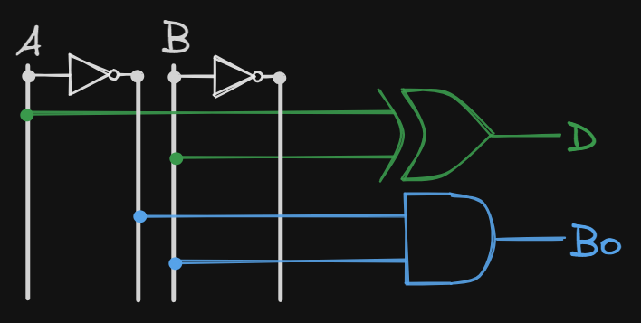

# Adder & Subtractor

## Half Adder

A half adder is a combinational circuit that performs the addition of two bits and produces a sum bit and a carry bit. It has two inputs: A and B, which add two input digits, and two outputs: S and C, which are the sum and carry out.

<figure><figcaption>
Half Adder
</figcaption></figure>

Truth Table for Half Adder:

|  A  |  B  |  S  |  C  |
| :-: | :-: | :-: | :-: |
|  0  |  0  |  0  |  0  |
|  0  |  1  |  1  |  0  |
|  1  |  0  |  1  |  0  |
|  1  |  1  |  0  |  1  |

The K-Map for the sum bit is:

<figure><figcaption>
K-map for sum bit
</figcaption></figure>

The boolean expression for the sum bit is:

$$
S = A \oplus B
$$

The K-Map for the carry bit is:

<figure><figcaption>
K-map for carry bit
</figcaption></figure>

The boolean expression for the carry bit is:

$$
C = A.B
$$

Logic gate for half adder:

<figure><figcaption>
Half Adder
</figcaption></figure>

### Half Adder using NAND Gates

A half adder can be implemented using two NAND gates. The sum bit is the output of the first NAND gate and the carry bit is the output of the second NAND gate. 

<figure><figcaption>
Half adder using NAND gates
</figcaption></figure>

### Half Adder using NOR Gates

Todo

## Full Adder

A full adder is a combinational circuit that performs the addition of three bits (two significant bits and a previous carry) and produces a sum bit and a carry bit. It has three inputs: A, B and $$C_{in}$$, which add three input digits, and two outputs: S and $$C_{out}$$, which are the sum and carry out.

$$
\begin{array}{|ccc|cc|}
\hline
\text{A} & \text{B} & C_{\text{in}} & \text{S} & C_{\text{out}} \\
\hline
0 & 0 & 0 & 0 & 0 \\
0 & 0 & 1 & 1 & 0 \\
0 & 1 & 0 & 1 & 0 \\
0 & 1 & 1 & 0 & 1 \\
1 & 0 & 0 & 1 & 0 \\
1 & 0 & 1 & 0 & 1 \\
1 & 1 & 0 & 0 & 1 \\
1 & 1 & 1 & 1 & 1 \\
\hline
\end{array}
$$

The K-map for for the sum bit is:

<figure><figcaption>
K-map for sum bit
</figcaption></figure>

In the K-Map, we see a chess board configuration. We can not create any groups.

The boolean expression for the sum bit is:

$$
\begin{align*}
S &= AB'C' + A'B'C + ABC + A'BC' \\
&= A \oplus B \oplus C
\end{align*}
$$

The K-map for the carry bit is:

<figure><figcaption>
One way
</figcaption></figure>

 

<figure><figcaption>
Another way
</figcaption></figure>

We can see that, we have more than one group configuration for the carry bit.  Every every group configuration, we will have different boolean expression. Every one of them is right.

The boolean expression for the carry bit is:

$$
\begin{align*} 
C_{out} &= A.B + B.C_{in} + A.C_{in} \\ C_{out} &= A.B + C_{in}.(A \oplus B)
\end{align*}
$$

### Full Adder using NAND Gates

Todo

### Full Adder using Half Adder

A full adder can be implemented using two half adders and one OR gate.

<figure><figcaption>
Full adder using half adder
</figcaption></figure>

## Four-bit Parallel Adder using Full Adder

A four-bit parallel adder can be implemented using four full adders.

<figure><figcaption>
Four bit full adder
</figcaption></figure>

## Half Subtractor

A half subtractor is a combinational circuit that performs the subtraction of two bits and produces a difference bit and a borrow bit. It has two inputs: A and B, which are the minuend and subtrahend, and two outputs: D and Bo, which are the difference and borrow out. The borrow out is used in the next stage of subtraction.

<figure><figcaption>
Half subtractor
</figcaption></figure>

<figure><figcaption>
2-Bit binary subtraction between
</figcaption></figure>

Truth Table for half subtractor:
$$
\begin{array}{|c|c|c|c|}
\hline
\ A \ & \ B \ & \ D \ & \ B_o \ \\
\hline
0 & 0 & 0 & 0 \\
\hline
0 & 1 & 1 & 1 \\
\hline
1 & 0 & 1 & 0 \\
\hline
1 & 1 & 0 & 0 \\
\hline
\end{array}
$$

The boolean expression for the difference bit is:
$$
D = A \oplus B
$$

The boolean expression for the borrow bit is:
$$
B_o = A'B
$$

Logic gate for half subtractor:
<figure><figcaption>
Half subtractor
</figcaption></figure>

### Half Subtractor using NAND Gates

Todo

## Full Subtractor

A full subtractor is a combinational circuit that performs the subtraction of three bits (two significant bits and a previous borrow) and produces a difference bit and a borrow bit. It has three inputs: A, B and $$B_{in}$$, which are the minuend, subtrahend and borrow in, and two outputs: D and $$B_{out}$$, which are the difference and borrow out. The borrow out is used in the next stage of subtraction. 

<figure><figcaption>
Full subtractor
</figcaption></figure>

Truth Table for full subtractor:
$$
\begin{array}{|c|c|c|c|c|}
\hline
\quad A \quad & \quad B \quad & \quad B_{in} \quad & \quad D \quad & \quad B_{out} \quad \\
\hline
0 & 0 & 0 & 0 & 0 \\
\hline
0 & 0 & 1 & 1 & 1 \\
\hline
0 & 1 & 0 & 1 & 1 \\
\hline
0 & 1 & 1 & 0 & 1 \\
\hline
1 & 0 & 0 & 1 & 0 \\
\hline
1 & 0 & 1 & 0 & 0 \\
\hline
1 & 1 & 0 & 0 & 0 \\
\hline
1 & 1 & 1 & 1 & 1 \\
\hline
\end{array}
$$

The K-map for the difference bit is:
<figure><figcaption>
K-map for difference bit
</figcaption></figure>

The boolean expression for the difference bit is:
$$
D = A \oplus B \oplus B_{in}
$$

The K-map for the borrow bit is:
<figure><figcaption>
K-map for borrow bit
</figcaption></figure>

The boolean expression for the borrow bit is:
$$
B_{out} = B.C + A'.B + A'.C
$$

Logic gate for full subtractor:
<figure><figcaption>
Full subtractor
</figcaption></figure>

### Full Subtractor using NAND Gates

Todo

## Four-bit Parallel Subtractor using Full Subtractor

Todo

## Four-bit Parallel Adder-Subtractor

Todo

## Binary Adder-Subtractor

Todo

## 2-bit Multiplier

A 2-bit multiplier is a combinational circuit that performs the multiplication of two 2-bit numbers and produces a 4-bit product. It has two inputs: A and B, which are the multiplicand and multiplier, and four outputs: P0, P1, P2 and P3, which are the product bits.

<figure><figcaption>
2-bit multiplier
</figcaption></figure>

$$
\begin{array}{cccc}
& A & = & A_1 & A_0 \\
\times & B & = & B_1 & B_0 \\
\hline
& &  & A_1B_0 & A_0B_0 \\
& + & A_1B_1 & A_0B_1 &  \\
\hline
& C_2 & \begin{gathered}
A_1B_1+ \\ C_1 \\ (C_2)
\end{gathered} & \begin{gathered}
A_1B_0 + \\ A_0B_1 \\ (C_1)
\end{gathered} & A_0B_0 \\
\hline
& P_3 & P_2 & P_1 & P_0 \\
\end{array}
$$
The product bits are:
$$
\begin{align*}
P_0 &= A_0B_0 \\
P_1 &= A_1B_0 + A_0B_1 \\
P_2 &= A_1B_1 + C_1 \\
P_3 &= C_1
\end{align*}
$$
We can see that the product bits are the sum of the partial products and the carry bits. The $$P_0$$ can be implemented using an AND gate. The $$P_1$$ and $$P_2$$ can be implemented using two half adder circuits. The $$P_3$$ can be implemented using an OR gate. 

The logic gate for 2-bit multiplier:
<figure><figcaption>
2-bit multiplier
</figcaption></figure>

## Carry Lookahead Adder

Todo

## BCD Adder

Todo

