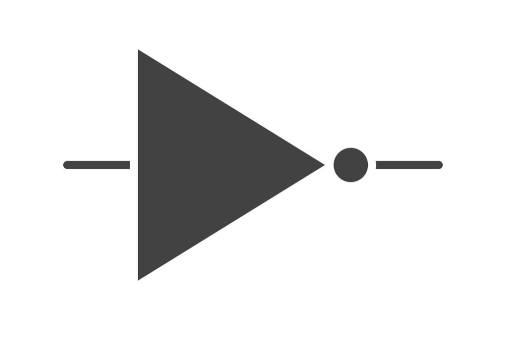

# Boolean Algebra

## Introduction

It is the set of rules used to simplify the given logic expression without changing its functionality. It is used when number of variables are less. A variable whose value can be either 1 or 0 is called a Boolean variable.

AND, OR , NOT are the basic Boolean operations. We can express Boolean functions with either an expression or a truth table. Every Boolean expression can be converted to a circuit.

* AND is denoted by a dot ( . ).
* OR is denoted by a plus ( + ).
* NOT is denoted by an over bar ( $$\overline A$$ ) , a single quote mark ( ' ), or tilde sign ( \~ ) before the variable.

Truth table for basic logic operation:



$$
\begin{array}{|cc|c|}
\hline
\text{A} & \text{B} & \text{AB} \\
\hline
0 & 0 & 0 \\
0 & 1 & 0 \\
1 & 0 & 0 \\
1 & 1 & 1 \\
\hline
\end{array}
$$




$$
\begin{array}{|cc|c|}
\hline
\text{A} & \text{B} & \text{A+B} \\
\hline
0 & 0 & 0 \\
0 & 1 & 1 \\
1 & 0 & 1 \\
1 & 1 & 1 \\
\hline
\end{array}
$$



$$
\begin{array}{|c|c|}
\hline
\text{A} & \sim \text{A} \\
\hline
0 & 1 \\
1 & 0 \\
\hline
\end{array}
$$




The order of evaluation is:

1. Parentheses
2. NOT
3. AND
4. OR

Consequence: Parentheses appear around OR expressions. Example,

```
F = A(B+C)(C+D)
```

### Boolean Algebra Postulates

* Identity Law -> $$A+0=A \quad and \quad A.1=A$$
* Domination Law -> $$A+1=1 \quad and \quad A.0=0$$
* Idempotent Law -> $$A+A=A \quad and \quad A.A=A$$
* Commutative Law -> $$A+B=B+A \quad and \quad A.B=B.A$$
* Associative Law -> $$A+(B+C)=(A+B)+C \quad and \quad A.(B.C)=(A.B).C$$
* Distributive Law -> $$A.(B+C) = A.B+A.C \quad and \quad A+B.C=(A+B).(A+C)$$
* De Morgan's Theorem

### De Morgan's Theorem

$$
( X . Y)' = X' + Y' \quad and \quad ( X + Y)' = X'.Y'
$$

### Absorption Theorem

$$
X.(X+Y)=X \quad and \quad X+(X.Y)=X
$$

### Redundancy Theorem


## Logic Gate

In the earliest computers, switches were opened and closed by magnetic fields produced by energizing coils in relays. The switches in turn opened and closed the current paths. Later, vacuum tubes were used to open and close current paths electronically to replace relays. Today, transistors are used as electronic switches that open and close current paths.

### Symbols

<div align="center">

<figure><figcaption><p>AND Gate</p></figcaption></figure>

 

<figure><figcaption><p>OR Gate</p></figcaption></figure>

 

<figure><figcaption><p>NOT Gate</p></figcaption></figure>

</div>

## Boolean Functions

A Boolean function is a function whose arguments, as well as the function itself, assume values from a two-element set {0, 1}. Example:

```
F(X, Y) = X'Y' + XY + X'Y
```

### Some examples

Example 1:

$$
\begin{align*} F &= A.B + A.B' \\ &= A(B+B') \\ &= A.1 \\ &= A \end{align*}
$$




$$
\begin{array}{|cc|c|}
\hline
\text{A} & \text{B} & F=A.B + A.\overline{B} \\
\hline
0 & 0 & 0 \\
0 & 1 & 0 \\
1 & 0 & 1 \\
1 & 1 & 1 \\
\hline
\end{array}
$$








Example 2:

$$
\begin{align*} F &= A.B + A.B'C + AB'C' \\ &= A(B+B'C+B'C') \\ &= A(B+C+B'C') \quad \text{Distributive law} \\ 
&= A(B+C+C') \quad \text{Distributive law} \\ 
&= A(B+1) \\ &= A.1 \\ &= A \end{align*}
$$

Example 3:

$$
\begin{align*}
    F   &= (A+B+C)(A+B'+C)(A+B+C') \\
        &= (A+B+C)(A+B+C')(A+B'+C) \quad \text{Commulative law} \\
        &= (X+C.C')(A+B'+C) \quad let, \quad X=A+B \quad \text{Distributive law} \\
        &= (X+0)(A+B'+C) \\
        &= X(A+B'+C) \\
        &= (A+B)(A+B'+C) \\
        &= A+B(B'+C) \\
        &= A + B.B' + BC \\
        &= A + 0 + C \\
        &= A+C
\end{align*}
$$

Example 4:

$$
\begin{align*}
    F   &= (A+B)(A+B')(A'+B)(A'B') \\
        &= (A + B.B')(A'+B.B') \\
        &= (A+0)(A'+b) \\
        &= A.A' \\
        &= 0
\end{align*}
$$

Example 5:

$$
\begin{align*}
    F   &= A.B + A'.C + B.C \\
        
\end{align*}
$$

There are two ways to convert truth tables to Boolean functions:

* Using Sum of Products / Minterms
* Using Product of Sums / Maxterms

### Minterm

* Product (AND function)
* Contains all variables
* Evaluates to '1' for a specific combination

### Maxterm

* Sum (OR function)
* Contains all variables
* Evaluates to '0' for a specific combination
