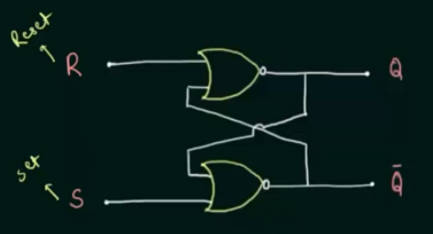

# Flip Flops

A flip-flop is a sequential circuit which stores the data in the form of binary. It has two outputs: Q and Q'. The output Q is the complement of Q'. 

## Types of Flip-Flops

1. **SR Flip-Flop**: It has two inputs: S and R. It has two outputs: Q and Q'. It has two stable states: Set and Reset. It has two invalid states: Hold and Toggle. It is also called as SR Latch.

2. **D Flip-Flop**: It has one input: D. It has two outputs: Q and Q'. It has one stable state: Set. It has one invalid state: Hold.

3. **JK Flip-Flop**: It has three inputs: J, K and CLK. It has two outputs: Q and Q'. It has four stable states: Set, Reset, Hold and Toggle.

4. **T Flip-Flop**: It has one input: T. It has two outputs: Q and Q'. It has two stable states: Set and Reset. It has two invalid states: Hold and Toggle.

## SR Flip-Flop

<firgure><figcaption>
SR Flip-Flop
</figcaption></figure>

Truth Table for NAND gate:
$$
\begin{array}{|cc|c|c|}
\hline
S^* & R^* & Q & Q' \\
\hline
0 & 0 & \text{Invalid} & \text{Invalid} \\
0 & 1 & 1 & 0 \\
1 & 0 & 0 & 1 \\
1 & 1 & \text{Not changed} & {Not Changed} \\
\end{array}
$$

Boolean expression for SR Flip-Flop:
$$
\begin{align*}
S^* &= \overline{S.Clk} \\
    &= \overline{S} + \overline{Clk} \\
R^* &= \overline{R.Clk} \\
    &= \overline{R} + \overline{Clk} \\
\end{align*}
$$

The truth table for SR Flip-Flop is:
$$
\begin{array}{|ccc|cc|}
\hline
Clk & S & R & Q & Q' \\
\hline
0 & x & x & \text{Not changed} & \text{Not changed} \\
1 & 0 & 0 & \text{Not changed} & \text{Not changed} \\
1 & 0 & 1 & 0 & 1 \\
1 & 1 & 0 & 1 & 0 \\
1 & 1 & 1 & \text{Invalid} & \text{Invalid} \\
\hline
\end{array}
$$

The characteristic table for SR Flip-Flop is:
$$
\begin{array}{|ccc|c|}
\hline
Q_n & S & R & Q_{n+1} \\
\hline
0 & 0 & 0 & 0 \\
0 & 0 & 1 & 0 \\
0 & 1 & 0 & 1 \\
0 & 1 & 1 & \text{X} \\
1 & 0 & 0 & 1 \\
1 & 0 & 1 & 0 \\
1 & 1 & 0 & 1 \\
1 & 1 & 1 & \text{X} \\
\hline
\end{array}
$$

The characteristic equation for SR Flip-Flop is:
$$
\begin{align*}
Q_{n+1} &= S + R'Q_n \\
\end{align*}
$$

The excitation table for SR Flip-Flop is:
$$
\begin{array}{|cc|cc|}
\hline
Q_n & Q_{n+1} & S & R \\
\hline
0 & 0 & 0 & \text{X} \\
0 & 1 & 1 & 0 \\
1 & 0 & 0 & 1 \\
1 & 1 & \text{X} & 0 \\
\hline
\end{array}
$$

The excitation equation for SR Flip-Flop is:
$$
\begin{align*}
to do
\end{align*}
$$

## D Flip-Flop

<firgure><figcaption>
D Flip-Flop
</figcaption></figure>

Truth Table for D Flip-Flop:
$$
\begin{array}{|ccc|c|}
\hline
Clk & D & Q & Q' \\
0 & x & \text{Not changed} & \text{Not changed} \\
1 & 0 & 0 & 1 \\
1 & 1 & 1 & 0 \\
\hline
\end{array}
$$

The characteristic table for D Flip-Flop is:
$$
\begin{array}{|cc|c|}
\hline
Q_n & D & Q_{n+1} \\
\hline
0 & 0 & 0 \\
0 & 1 & 1 \\
1 & 0 & 0 \\
1 & 1 & 1 \\
\hline
\end{array}
$$

The excitation table for D Flip-Flop is:
$$
\begin{array}{|cc|c|}
\hline
Q_n & Q_{n+1} & D \\
\hline
0 & 0 & 0 \\
0 & 1 & 1 \\
1 & 0 & 0 \\
1 & 1 & 1 \\
\hline
\end{array}
$$

## JK Flip-Flop

<firgure><figcaption>
JK Flip-Flop
</figcaption></figure>

Truth Table for JK Flip-Flop:
$$
\begin{array}{|ccc|cc|}
\hline
Clk & J & K & Q & Q' \\
0 & x & x & \text{Not changed} & \text{Not changed} \\
1 & 0 & 0 & \text{Not changed} & \text{Not changed} \\
1 & 0 & 1 & 0 & 1 \\
1 & 1 & 0 & 1 & 0 \\
1 & 1 & 1 & \text{Toggle} & \text{Toggle} \\
\hline
\end{array}
$$

