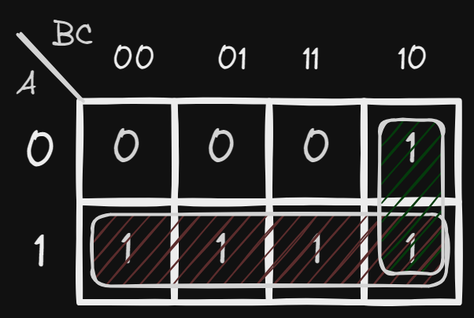
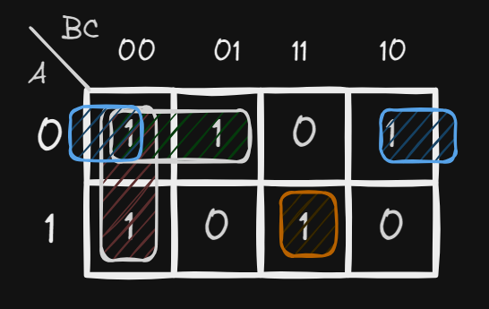
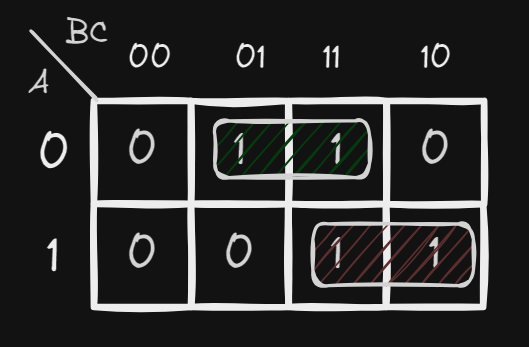
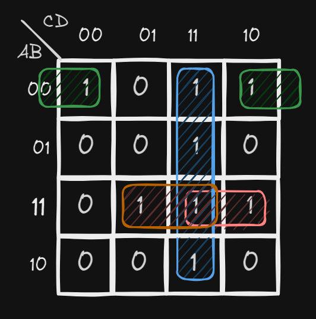

# K-Map

## Karnaugh Map

This is a method to simplify boolean algebra expressions. It reduces the need for extensive calculations by taking advantages of human's pattern recognition capability.

The required boolean results are transferred from a truth table onto a two-dimensional grid where the cells are ordered in Gray Code, and each cell position represents one combination of input conditions, while each cell value represents the corresponding output value. Optimal groups of 1s or 0s are identified. These terms can be used to write a minimal boolean expression representing the required logic.

## Rules of Simplification

* Adjacent cell on a K-Map differs by only one variable.
* Groups may not include any cell containing a zero.
* Groups maybe horizontal or vertical, but not diagonal.
* Group must contain $$2^n$$cells, like 1, 2, 4, or 8.
* Groups should be as large as possible.
* Each cell containing a 1 must be in at least one group.
* Groups may overlap
* Groups may wrap around the table. Like the leftmost cell in a row may be grouped with the rightmost cell in that row. Similar for columns also.
* Number of groups should be as few as possible.

## Examples

### Example 0

Truth Table:

<table data-full-width="false"><thead><tr><th align="center">A</th><th align="center">B</th><th width="173" align="center">C</th><th align="center">F</th></tr></thead><tbody><tr><td align="center">0</td><td align="center">0</td><td align="center">0</td><td align="center">0</td></tr><tr><td align="center">0</td><td align="center">0</td><td align="center">1</td><td align="center">0</td></tr><tr><td align="center">0</td><td align="center">1</td><td align="center">0</td><td align="center">1</td></tr><tr><td align="center">0</td><td align="center">1</td><td align="center">1</td><td align="center">0</td></tr><tr><td align="center">1</td><td align="center">0</td><td align="center">0</td><td align="center">1</td></tr><tr><td align="center">1</td><td align="center">0</td><td align="center">1</td><td align="center">1</td></tr><tr><td align="center">1</td><td align="center">1</td><td align="center">0</td><td align="center">1</td></tr><tr><td align="center">1</td><td align="center">1</td><td align="center">1</td><td align="center">1</td></tr></tbody></table>

Canonical SOP:

$$
\begin{align*} F &= \bar A B \bar C + A \bar B \bar C + A \bar B C + A B \bar C + A B C \\ F &= \bar A B \bar C + A \bar B ( \bar C + C ) + A B ( C + \bar C) \\ F &= \bar A B \bar C + A \bar B + A B \\ F &= \bar A B \bar C + A \\ F &= A + B \bar C \end{align*}
$$


K-Map Diagram for the above truth table:

<figure><figcaption><p>K-Map Diagram</p></figcaption></figure>

Check the change of value of variables in rows and columns for each group. We will only take the variables that does not change in a row or a column and do AND operation. We do the same thing for every group and do OR operation with each group.

The above diagram gives the following simplified expression:

$$
F = A + B \bar C
$$

This expression is the same as the one we got from the canonical SOP. We can not further simplify this expression. The resulted expression is minimum but not unique. There may be other expressions which are also minimum.

### Example 1

$$
F(A,B,C) = \sum m(1, 3, 5, 7)
$$

i. Find out number of variables and number of cells in the K-Map.

```
Number of variables = 3 (A, B, C)
Number of cells = 2^3 = 8
```

ii. Draw the K-Map and find the Boolean expression.

<figure><figcaption><p>Example 01</p></figcaption></figure>

The simplified expression is:

$$
F = C
$$

### Example 2

$$
F(A,B,C) = \sum m(0, 1, 2, 4, 7)
$$

Draw the K-Map and find the Boolean expression.

<figure><figcaption><p>Example 02</p></figcaption></figure>

The simplified expression is:

$$
F = B'.C' + A'.B' + A'.C' + A.B.C
$$

### Example 3

$$
F(A,B,C) = \sum m(1, 3, 6, 7)
$$

Draw the K-Map and find the Boolean expression.

<figure><figcaption><p>Example 03</p></figcaption></figure>

The simplified expression is:

$$
F = A.B + A'.C
$$

### Example 4

$$
F(A,B,C) = \sum m(0, 1, 5, 6, 7)
$$

Draw the K-Map and find the Boolean expression.

<div>

<figure><figcaption><p>One way</p></figcaption></figure>

 

<figure><figcaption><p>Another way</p></figcaption></figure>

</div>

The simplified expression for the left diagram is:

$$
F = A.B + A'B' + B'.C
$$

The simplified expression for the right diagram is:

$$
F = A.B + A'B' + A.C
$$

## Implicants

The groups we make in K-Map are called implicants. There are two types of implicants:

* Prime Implicants: It is the largest possible group that can be made in a K-Map.
* Essential Prime Implicants: It is the prime implicant that contains at least one cell with 1 that is not contained in any other prime implicant.

Example:

<figure><figcaption></figcaption></figure>

Group-1: It is a prime implicant and also an essential prime implicant. Because the lower 1 of this group can not be included in any other group.&#x20;

Group-2: It is a prime implicant but not an essential prime implicant. Because both of the 1s of this group can be included in other groups.&#x20;

Group-3: It is a prime implicant and also an essential prime implicant. Because the upper 1 of this group can not be included in any other group.

## 4-Variable K-Map

### Example 5

$$
F(A,B,C,D)=\sum m(0,2,3,7,11,13,14,15)
$$

Answer:

<figure><figcaption><p>Example 1</p></figcaption></figure>

The boolean expression from the K-map is,

$$
\begin{align*}
F = CD + A'B'D' + ABC + ABD
\end{align*}
$$

### Example 6

$$
F(A,B,C,D) = \sum m (0,2,3,5,7,8,10,11,14,15)
$$

Answer:

<figure><figcaption><p>Example 2</p></figcaption></figure>

The boolean expression from the K-map is,

$$
F= CD + B'D' + AC + A'BD
$$

### Example 7

$$
F(X,Y,Z,W)=\sum m (1, 5, 7, 9, 11, 13, 15)
$$

Answer:

<figure><figcaption><p>Example 3</p></figcaption></figure>

The boolean expression from the K-map is,

$$
F = Z'W + YW + XW
$$

## Don't Care in K-Map

Don't care is a condition where the output value does not matter. It can be either 0 or 1. We use X to represent don't care condition in K-Map. We can use don't care condition to reduce the number of literals in a boolean expression. We can not use don't care condition to reduce the number of variables. 


If all the values of K-map cells are 1, then answer is 1.

When we,

* &#x20;combine 2 1's -> 1 literal is reduced.
* combine 4 1's -> 2 literals are reduced.
* combine 8 1's -> 3 literals are reduced.
* combine 16 1's -> 4 literals are reduced.


## Pros ans Cons of K-Map

### Pros

* K-Map provides a visual and systematic method.
* Easy to use.

### Cons

* Effective, but only up to 5-6 input variables.
* Manual process.
* Error-prone.
