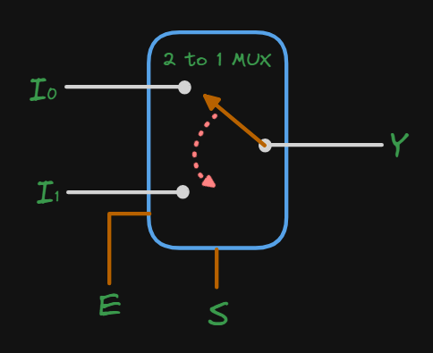
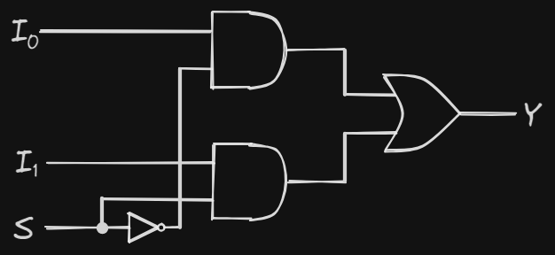
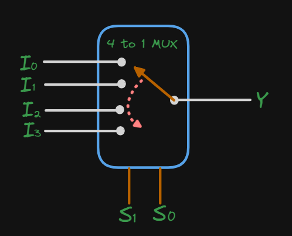
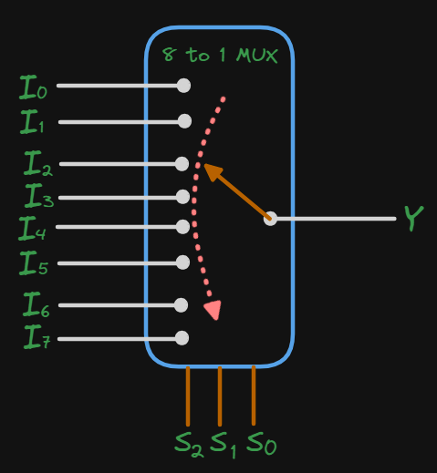
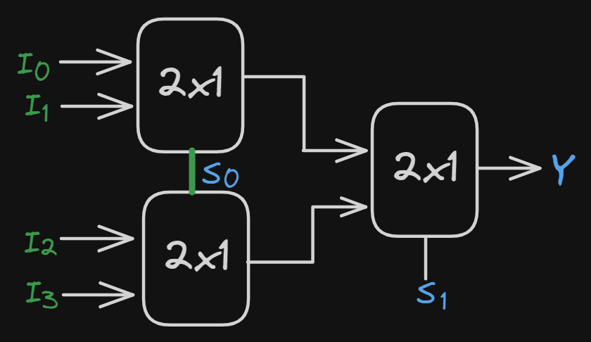
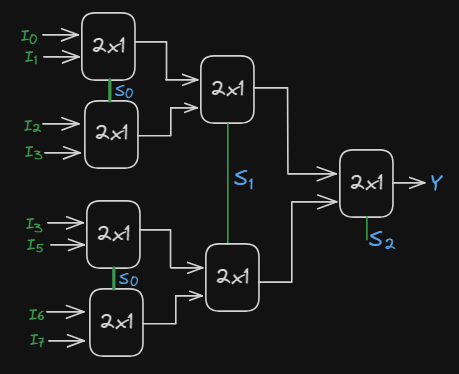
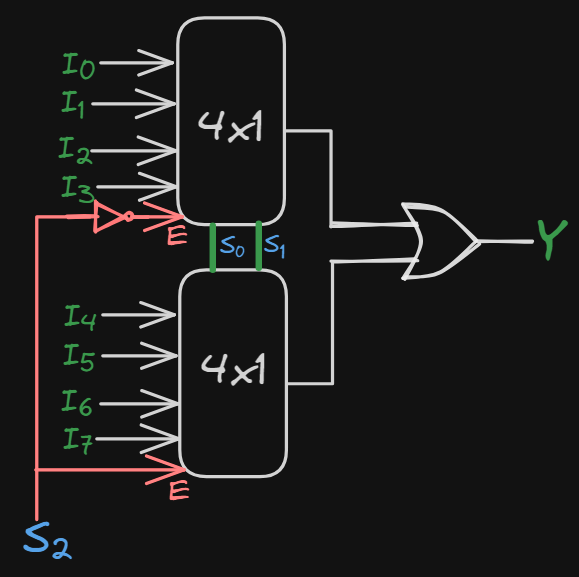

# Multiplexer

A multiplexer is a combinational circuit that selects one of many input signals and directs it to a single output. It is also known as a data selector. The selection of a particular input is controlled by a set of selection lines. The number of selection lines determines the number of input lines. A multiplexer with n selection lines can select one of 2^n input lines.

## Advantages

* Reduces the number of logic gates required to perform a particular function.
* Reduces the number of pins required to connect a large number of inputs to a device.
* Reduces the complexity of the circuit and cost.

## Types of Multiplexers

There are different types of multiplexers based on the number of input lines and selection lines. The most commonly used multiplexers are 2-to-1, 4-to-1, and 8-to-1 multiplexers.

The relationship between the input lines, selection lines, and output line is,
$$
n=2^m \implies m = \log_2 n
$$
where _n_ is the number of input lines and _m_ is the number of selection lines.

### 2-to-1 Multiplexer

The block diagram of a 2-to-1 multiplexer is shown below:

<figure><figcaption>
Block diagram of a 2-to-1 multiplexer
</figcaption></figure>

From the block diagram, it can be seen that a 2-to-1 multiplexer has 2 input lines, 1 selection line, and 1 output line. We also have an enable line (E) which is used to enable the multiplexer. The selection line is used to select one of the input lines. The output of the multiplexer is the selected input line. The truth table for a 2-to-1 multiplexer is shown below:

$$
\begin{array}{|c|c|c|}
\hline
E & S & Y \\
\hline
0 & \times & 0 \\
1 & 0 & I_0 \\
1 & 1 & I_1 \\
\hline
\end{array}
$$

The boolean expression for the output Y is:

$$
Y = ES'I_0 + ESI_1 \\
Y = E(S'I_0 + SI_1)
$$

The logic diagram for a 2-to-1 multiplexer is shown below:

<figure><figcaption>
Logic diagram of a 2-to-1 multiplexer
</figcaption></figure>

### 4-to-1 Multiplexer

A 4-to1 multiplexer has 4 input lines, 2 selection lines, and 1 output line. The selection lines are used to select one of the input lines. The output of the multiplexer is the selected input line.

The block diagram of a 4-to-1 multiplexer is shown below:

<figure><figcaption>
Block diagram of a 4-to-1 multiplexer
</figcaption></figure>

The truth table for a 4-to-1 multiplexer is shown below:

$$
\begin{array}{|c|c|c|}
\hline
S_1 & S_0 & Y \\
\hline
0 & 0 & I_0 \\
0 & 1 & I_1 \\
1 & 0 & I_2 \\
1 & 1 & I_3 \\
\hline
\end{array}
$$

The boolean expression for the output Y is:

$$
Y = S_1'S_0'I_0 + S_1'S_0I_1 + S_1S_0'I_2 + S_1S_0I_3
$$

The logic diagram for a 4-to-1 multiplexer is shown below:

<figure><figcaption>
Logic diagram of a 4-to-1 multiplexer
</figcaption></figure>

### 8-to-1 Multiplexer  

An 8-to-1 multiplexer has 8 input lines, 3 selection lines, and 1 output line. The selection lines are used to select one of the input lines. The output of the multiplexer is the selected input line. 

The block diagram of an 8-to-1 multiplexer is shown below:

<figure><figcaption>
Block diagram of an 8-to-1 multiplexer
</figcaption></figure>

The truth table for an 8-to-1 multiplexer is shown below:

$$
\begin{array}{|c|c|c|c|c|}
\hline
S_2 & S_1 & S_0 & Y \\
\hline
0 & 0 & 0 & I_0 \\
0 & 0 & 1 & I_1 \\
0 & 1 & 0 & I_2 \\
0 & 1 & 1 & I_3 \\
1 & 0 & 0 & I_4 \\
1 & 0 & 1 & I_5 \\
1 & 1 & 0 & I_6 \\
1 & 1 & 1 & I_7 \\
\hline
\end{array}
$$

The boolean expression for the output Y is:

$$
\begin{aligned}
Y = & S_2'S_1'S_0'I_0 + S_2'S_1'S_0I_1 + S_2'S_1S_0'I_2 + S_2'S_1S_0I_3 \\
& + S_2S_1'S_0'I_4 + S_2S_1'S_0I_5 + S_2S_1S_0'I_6 + S_2S_1S_0I_7
\end{aligned}
$$

The logic diagram for an 8-to-1 multiplexer is shown below:

<figure><figcaption>
Logic diagram of an 8-to-1 multiplexer
</figcaption></figure>

## Mux Tree

A mux tree is a combination of multiplexers used to select one of many input lines. It is used to reduce the number of logic gates required to perform a particular function. The mux tree is used to select one of many input lines and direct it to a single output. The selection of a particular input is controlled by a set of selection lines. The number of selection lines determines the number of input lines. A mux tree with n selection lines can select one of 2^n input lines.

### 4-to-1 Mux using 2-to-1 Mux

A 4-to-1 multiplexer can be implemented using 2-to-1 multiplexers. The block diagram of a 4-to-1 multiplexer using 2-to-1 multiplexers is shown below:

<figure><figcaption>
Block diagram of a 4-to-1 multiplexer using 2-to-1 multiplexers
</figcaption></figure>

The truth table for a 4-to-1 multiplexer is shown below:

$$
\begin{array}{|c|c|c|}
\hline
S_1 & S_0 & Y \\
\hline
0 & 0 & I_0 \\
0 & 1 & I_1 \\
1 & 0 & I_2 \\
1 & 1 & I_3 \\
\hline
\end{array}
$$

The boolean expression for the output Y is:

The logic diagram for a 4-to-1 multiplexer using 2-to-1 multiplexers is shown below:

<figure><figcaption>
Logic diagram of a 4-to-1 multiplexer using 2-to-1 multiplexers
</figcaption></figure>

### 8-to-1 Mux using 2-to-1 Mux

An 8-to-1 multiplexer can be implemented using 2-to-1 multiplexers. The block diagram of an 8-to-1 multiplexer using 2-to-1 multiplexers is shown below:

<figure><figcaption>
Block diagram of an 8-to-1 multiplexer using 2-to-1 multiplexers
</figcaption></figure>

The truth table for an 8-to-1 multiplexer is shown below:

$$
\begin{array}{|c|c|c|c|c|}
\hline
S_2 & S_1 & S_0 & Y \\
\hline
0 & 0 & 0 & I_0 \\
0 & 0 & 1 & I_1 \\
0 & 1 & 0 & I_2 \\
0 & 1 & 1 & I_3 \\
1 & 0 & 0 & I_4 \\
1 & 0 & 1 & I_5 \\
1 & 1 & 0 & I_6 \\
1 & 1 & 1 & I_7 \\
\hline
\end{array}
$$

The boolean expression for the output Y is:

The logic diagram for an 8-to-1 multiplexer using 2-to-1 multiplexers is shown below:

<figure><figcaption>
Logic diagram of an 8-to-1 multiplexer using 2-to-1 multiplexers
</figcaption></figure>

### 8-to-1 Mux using 4-to-1 Mux

An 8-to-1 multiplexer can be implemented using 4-to-1 multiplexers. The block diagram of an 8-to-1 multiplexer using 4-to-1 multiplexers is shown below:

<figure><figcaption>
Block diagram of an 8-to-1 multiplexer using 4-to-1 multiplexers
</figcaption></figure>

We can take $$S_2$$ as the enalbe line for the 4-to-1 mux, because when $$S_2 = 0$$, it will select the upper 4-to-1 mux and when $$S_2 = 1$$, it will select the lower 4-to-1 mux. So it will act as a selector for the 8-to-1 mux.

The truth table for an 8-to-1 multiplexer is shown below:

$$
\begin{array}{|c|c|c|c|c|}
\hline
S_2 & S_1 & S_0 & Y \\
\hline
0 & 0 & 0 & I_0 \\
0 & 0 & 1 & I_1 \\
0 & 1 & 0 & I_2 \\
0 & 1 & 1 & I_3 \\
1 & 0 & 0 & I_4 \\
1 & 0 & 1 & I_5 \\
1 & 1 & 0 & I_6 \\
1 & 1 & 1 & I_7 \\
\hline
\end{array}
$$

The boolean expression for the output Y is:

The logic diagram for an 8-to-1 multiplexer using 4-to-1 multiplexers is shown below:

<figure><figcaption>
Logic diagram of an 8-to-1 multiplexer using 4-to-1 multiplexers
</figcaption></figure>

### 32-to-1 Mux using

### 64-to-1 Mux using

## Implementation of Boolean Function using Multiplexer

### Example

Implement the boolean function $$F(A, B, C, D) = \Sigma m(1, 4, 5, 7, 9, 12, 13)$$ using a 4-to-1 multiplexer.

### Solution

Step 1: Identify the number of input lines required for the given boolean function. The number of input lines required is 4.

Step 2: Identify the number of selection lines required for the given boolean function. The number of selection lines required is 2.

Step 3: Draw the K-map for the given boolean function.

<figure><figcaption>
K-map for the given boolean function
</figcaption></figure>

Step 4: Write the table for the required multiplexer.

$$
\begin{array}{|c|c|c|}
\hline
S_1 & S_0 & Y \\
\hline
0 & 0 & I_0 \\
0 & 1 & I_1 \\
1 & 0 & I_2 \\
1 & 1 & I_3 \\
\hline
\end{array}
$$

Step 5: Select the selection lines for the given boolean function.

$$
S_0 = B \\
S_1 = A
$$

Step 6: Match the K-map with the table and write the boolean expression for the output Y.

$$
\begin{aligned}
I_0 &= C'D \\
I_1 &= C' + D \\
I_2 &= C'D' \\
I_3 &= C' \\
\end{aligned}
$$

