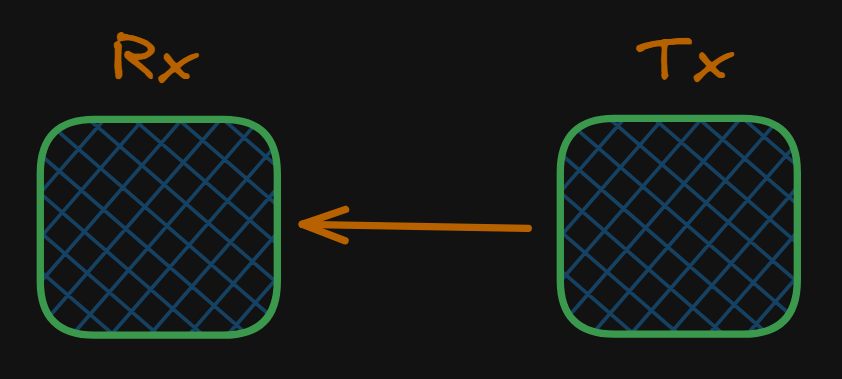
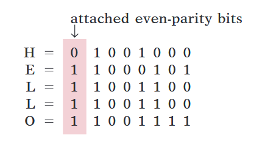
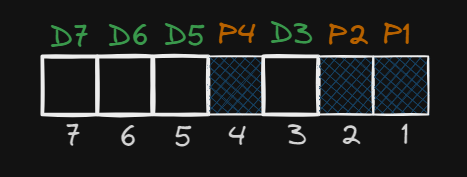
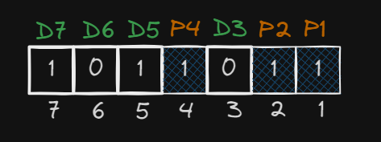

# Number System

## Decimal System

The decimal system is composed of 10 numerals or symbols. These 10 symbols are 0, 1, 2, 3, 4, 5, 6, 7, 8, 9; using these symbols as digits of a number, we can express any quantity. The decimal system, also called the base-10 system because it has 10 digits, has evolved naturally as a result of the fact that people have 10 fingers. In fact, the word digit is derived from the Latin word for "finger".

The decimal system is a positional-value system in which the value of a digit depends on its position.

## Binary System

In the binary system there are only two symbols or possible digit values, 0 and 1. Even so, this base-2 system can be used to represent any quantity that can be represented in decimal or other number systems. In general though, it will take a greater number of binary digits to express a given quantity. It is very easy to design simple, accurate electronic circuits that operate with only two voltage levels. For this reason, almost every digital system uses the binary number system as the basic number system of its operations.

There are numerous devices that have only two operating states or can be operated in two extreme conditions. Among these are: light bulb (bright or dark), diode (conducting or nonconducting), electromagnet (energized or de-energized), transistor (cut off or saturated), photocell (illuminated or dark), thermostat (open or closed), mechanical clutch (engaged or disengaged), and spot on a magnetic disk (magnetized or demagnetized)

## Parity

It is a method of detecting errors in data transmission. A single bit error in a data stream can be detected by using a parity bit. The parity bit is added to the data before it is transmitted. It is an extra bit that makes the number of 1s either even or odd.

<figure><figcaption>
Data Transmission
</figcaption></figure>

### Odd Parity

In odd parity, the number of 1s in the data is made odd by adding a parity bit. If the data has an even number of 1s, the parity bit is set to 1. If the data has an odd number of 1s, the parity bit is set to 0. The total number of 1s in the data and the parity bit is always odd. 

$$
\begin{array}{|c|c|c|c|c|c|c|c|c|c|c|}
\hline
\text{Data} &  & 1 & 1 & 0 & 1 & 0 & 1 & 1 & 1 & 0 \\
\hline
\text{With Parity} & 1 & 1 & 1 & 0 & 1 & 0 & 1 & 1 & 1 & 0 \\
\hline
\end{array}
$$

### Even Parity

In even parity, the number of 1s in the data is made even by adding a parity bit. If the data has an odd number of 1s, the parity bit is set to 1. If the data has an even number of 1s, the parity bit is set to 0. The total number of 1s in the data and the parity bit is always even. 

$$
\begin{array}{|c|c|c|c|c|c|c|c|c|c|c|}
\hline
\text{Data} & & 1 & 1 & 0 & 1 & 0 & 1 & 0 & 1 & 0 \\
\hline
\text{With Parity} & 1 & 1 & 1 & 0 & 1 & 0 & 1 & 0 & 1 & 0 \\
\hline
\end{array}
$$

Even parity code for in ASCII for the string "HELLO" is:
<figure><figcaption>
Even parity for 'HELLO'
</figcaption></figure>

## Hamming Code

It is a method of error correction in data transmission. It is a block code that is capable of detecting up to two simultaneous bit errors and correcting single-bit errors. It is named after its inventor, Richard Hamming. It is used in computer memory where it is known as ECC (error-correcting code). It is also used in satellite communication. 7-bit Hamming code is used commonly. In a 7-bit Hamming code, 4 bits are data bits and 3 bits are parity bits. The parity bits are placed at the positions of powers of 2. The positions of parity bits are 1, 2, 4. The data bits are placed at the remaining positions. The positions of data bits are 3, 5, 6, 7. The parity bits are calculated by XORing the data bits at the positions of powers of 2. The data bits are calculated by XORing the data bits at the remaining positions. 

<figure><figcaption>
&-bit Hamming code
</figcaption></figure>

$$
P_1 \rightarrow D_3,\ D_5,\ \ D_7 \\
P_2 \rightarrow D_3,\ D_6,\ D_7 \\
P_4 \rightarrow D_5,\ D_6,\ D_7 \\
$$

### Example

If the 7-bit Hamming code word received by the receiver is 1011011. Assuming that the data is transmitted using even parity, find whether the data is received correctly or not. If not, find the correct data.

**Solution:**
<figure><figcaption>
&-bit Hamming code
</figcaption></figure>

$$
\begin{array}{|c|c|c|c|c|}
\hline
\text{Bit} & P_4 & D_5 & D_6 & D_7 \\
\hline
\text{Value} & 1 & 1 & 0 & 1\\
\hline
\end{array}
$$
As the value of $P_4$ is 1 and the total number of 1s in the data is odd, the data is not received correctly. So, $$P_4=1$$

$$
\begin{array}{|c|c|c|c|c|}
\hline
\text{Bit} & P_2 & D_3 & D_6 & D_7 \\
\hline
\text{Value} & 1 & 0 & 0 & 1\\
\hline
\end{array}
$$
As the value of $P_2$ is 1 and the total number of 1s in the data is even, the data is received correctly. So, $$P_2=0$$

$$
\begin{array}{|c|c|c|c|c|}
\hline
\text{Bit} & P_1 & D_3 & D_5 & D_7 \\
\hline
\text{Value} & 1 & 0 & 1 & 1\\
\hline
\end{array}
$$

As the value of $P_1$ is 1 and the total number of 1s in the data is odd, the data is not received correctly. So, $$P_1=1$$

So, $$ P_1=1,\ P_2=0,\ P_4=1 $$, which is the binary equivalent of 5. So, the position of the error is 5. The correct data is $$D_5=0$$.

The correct data is 
$$
D_3=0,\ D_5=0,\ D_6=0,\ D_7=1
$$
And the code word is 1001011.
<figure><figcaption>
Code word
</figcaption></figure>

## 4-bit Even Parity Generator

$$
\begin{array}{|c|c|c|c|c|}
\hline
\ b_3 \ & \ b_2 \ & \ b_1 \ & \ b_0 \ & \ P_0 \ \\
\hline
0 & 0 & 0 & 0 & 0 \\
\hline
0 & 0 & 0 & 1 & 1 \\
\hline
0 & 0 & 1 & 0 & 1 \\
\hline
0 & 0 & 1 & 1 & 0 \\
\hline
0 & 1 & 0 & 0 & 1 \\
\hline
0 & 1 & 0 & 1 & 0 \\
\hline
0 & 1 & 1 & 0 & 0 \\
\hline
0 & 1 & 1 & 1 & 1 \\
\hline
1 & 0 & 0 & 0 & 1 \\
\hline
1 & 0 & 0 & 1 & 0 \\
\hline
1 & 0 & 1 & 0 & 0 \\
\hline
1 & 0 & 1 & 1 & 1 \\
\hline
1 & 1 & 0 & 0 & 0 \\
\hline
1 & 1 & 0 & 1 & 1 \\
\hline
1 & 1 & 1 & 0 & 1 \\
\hline
1 & 1 & 1 & 1 & 0 \\
\hline
\end{array}
$$

The K-map for the parity bit is:
<figure><figcaption>
K-map for parity bit
</figcaption></figure>

The Boolean expression for the parity bit is:
$$
P_0=b_0 \oplus b_1 \oplus b_2 \oplus b_3
$$
