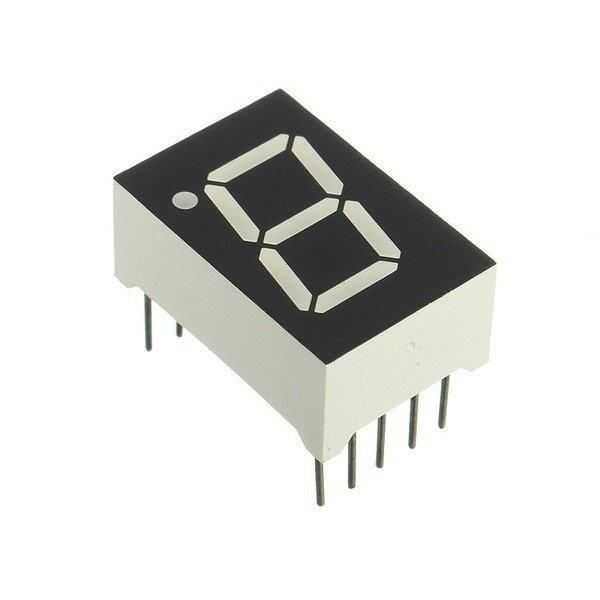

# Seven Segment Display

A seven-segment display is a form of electronic display device for displaying decimal numerals that is an alternative to the more complex dot matrix displays. Seven-segment displays are widely used in digital clocks, electronic meters, basic calculators, and other electronic devices that display numerical information.

<figure><figcaption>
Seven Segment Display
</figcaption></figure>

Here is the truth table for the bcd to seven segment decoder:
$$
\begin{array}{|c c c c c|c c c c c c c|}
\hline
D & b_3 & b_2 & b_1 & b_0 & a & b & c & d & e & f & g \\
\hline
0 & 0 & 0 & 0 & 0 & 1 & 1 & 1 & 1 & 1 & 1 & 0 \\
1 & 0 & 0 & 0 & 1 & 0 & 1 & 1 & 0 & 0 & 0 & 0 \\
2 & 0 & 0 & 1 & 0 & 1 & 1 & 0 & 1 & 1 & 0 & 1 \\
3 & 0 & 0 & 1 & 1 & 1 & 1 & 1 & 1 & 0 & 0 & 1 \\
4 & 0 & 1 & 0 & 0 & 0 & 1 & 1 & 0 & 0 & 1 & 1 \\
5 & 0 & 1 & 0 & 1 & 1 & 0 & 1 & 1 & 0 & 1 & 1 \\
6 & 0 & 1 & 1 & 0 & 1 & 0 & 1 & 1 & 1 & 1 & 1 \\
7 & 0 & 1 & 1 & 1 & 1 & 1 & 1 & 0 & 0 & 0 & 0 \\
8 & 1 & 0 & 0 & 0 & 1 & 1 & 1 & 1 & 1 & 1 & 1 \\
9 & 1 & 0 & 0 & 1 & 1 & 1 & 1 & 1 & 0 & 1 & 1 \\
\hline
\end{array}
$$

The K-map for the A segment is:

The boolean expression for the A segment is:
$$
a = b_1 + b_3 + b_0 \oplus b_2
$$

The K-map for the B segment is:

The boolean expression for the B segment is:
$$
do\ \ this
$$

Do the same for the other segments.
