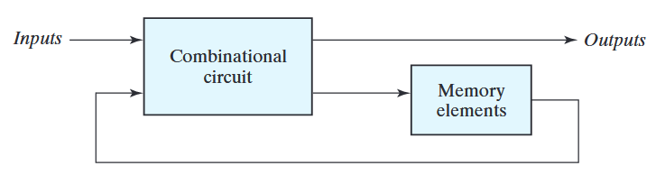

# SR Latch

> In sequential circuits, the present output depends on the present input as well as past output/outputs.

The past outputs are stored in memory.
<figure><figcaption>
Sequential Circuit
</figcaption></figure>

A latch is a memory device that stores the data in the form of 0s and 1s. It is a bistable device, i.e., it has two stable states. It can store one bit of data. The stored data can be changed by applying the appropriate inputs.

The SR latch is a circuit with two cross-coupled NOR gates or two cross-coupled NAND gates, and two inputs S(for set) and R(for reset). The output of one gate is connected to the input of the other gate and vice versa. The output of the first gate is Q and the output of the second gate is Q'. 

## Types of Latches

1. **SR Latch**: It has two inputs: S and R. It has two outputs: Q and Q'. It has two stable states: Set and Reset. It has two invalid states: Hold and Toggle.

2. **D Latch**: It has one input: D. It has two outputs: Q and Q'. It has one stable state: Set. It has one invalid state: Hold.

3. **JK Latch**: It has three inputs: J, K and CLK. It has two outputs: Q and Q'. It has four stable states: Set, Reset, Hold and Toggle.

4. **T Latch**: It has one input: T. It has two outputs: Q and Q'. It has two stable states: Set and Reset. It has two invalid states: Hold and Toggle.

## SR Latch using NOR gates

<figure><figcaption>
SR Latch
</figcaption></figure>

The reset input will reset the latch to 0 and the set input will set the latch to 1.

Truth Table for NOR gate:
$$
\begin{array}{|cc|c|}
\hline
A & B & Y \\
\hline
0 & 0 & 1 \\
0 & 1 & 0 \\
1 & 0 & 0 \\
1 & 1 & 0 \\
\hline
\end{array}
$$

Case 1: When S=0 and R=1, the output Q=0 and Q'=1. This is the reset condition. The latch is reset to 0.
After the reset, if S=0 and R=0, the output Q=0 and Q'=1. The data is stored in the latch.

Case 2: When S=1 and R=0, the output Q=1 and Q'=0. This is the set condition. The latch is set to 1.
After the set, if S=0 and R=0, the output Q=1 and Q'=0. The data is stored in the latch.

Case 3: When S=1 and R=1, the output Q=0 and Q'=0. This is the invalid condition. The output is unpredictable.
After the invalid condition, if S=0 and R=0, the output Q=0 and Q'=1(if we start from reset condition) or Q=1 and Q'=0(if we start from set condition). Both the outputs are different and unpredictable.

So,
$$
\begin{array}{|cc|c|c|}
\hline
S & R & Q & Q' \\
\hline
0 & 0 & \text{Not changed} & \text{Not changed} \\
0 & 1 & 0 & 1 \\
1 & 0 & 1 & 0 \\
1 & 1 & \text{Invalid} & \text{Invalid} \\
\hline
\end{array}
$$

## SR Latch using NAND gates

For NAND gate, the truth table will be:
$$
\begin{array}{|cc|c|c|}
\hline
S & R & Q & Q' \\
\hline
0 & 0 & \text{Invalid} & \text{Invalid} \\
0 & 1 & 1 & 0 \\
1 & 0 & 0 & 1 \\
1 & 1 & \text{Not changed} & \text{Not changed} \\
\hline
\end{array}
$$

## Clock signal

The clock signal is used to synchronize the operation of the sequential circuits. The clock signal is a square wave signal. It is a periodic train of pulses which changes its states between the logic 1 and logic 0. It has 4 states: rising edge, falling edge, high state, and low state. Latches are level triggered and flip-flops are edge triggered. 

Duty cycle is the ratio of the time period for which the signal is high to the time period for which the signal is low. It is expressed as a percentage. It is used to measure the stability of the clock signal. The duty cycle should be 50% for a stable clock signal.

## Triggering Methods

1. Edge triggering: The flip-flop is triggered by the rising edge or falling edge of the clock signal.
2. Level triggering: The latch is triggered by the level of the clock signal.

The clock pulse is applied to the latch or flip-flop to change the state of the output. We trigger the latch or flip-flop by the above two methods.

Edge triggering is used in flip-flops. It has two types: positive edge triggering and negative edge triggering. In positive edge triggering, the output changes at the rising edge of the clock signal. In negative edge triggering, the output changes at the falling edge of the clock signal.

Level triggering is used in latches. The output changes when the clock signal is high level or low level.

## Differnce between latch and flip-flop

1. Latch is level triggered and flip-flop is edge triggered.
2. Latch is faster than flip-flop.
3. Flip-flop is more reliable than latch.
4. Flip-flop is used in synchronous circuits and latch is used in asynchronous circuits.
